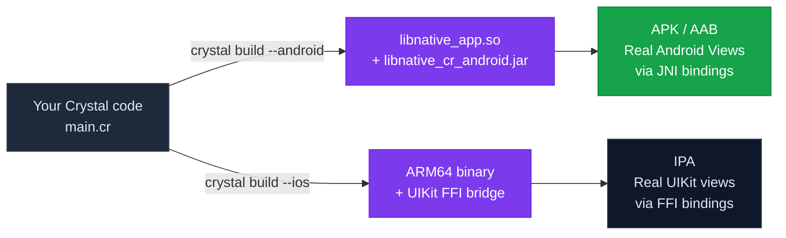
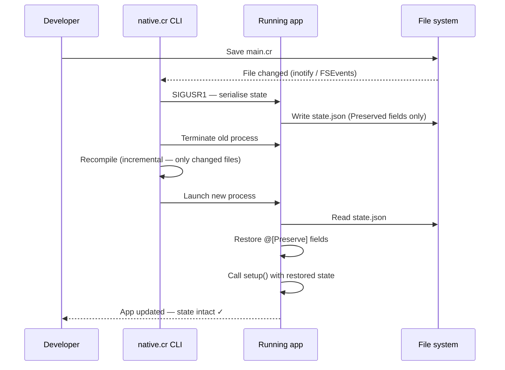
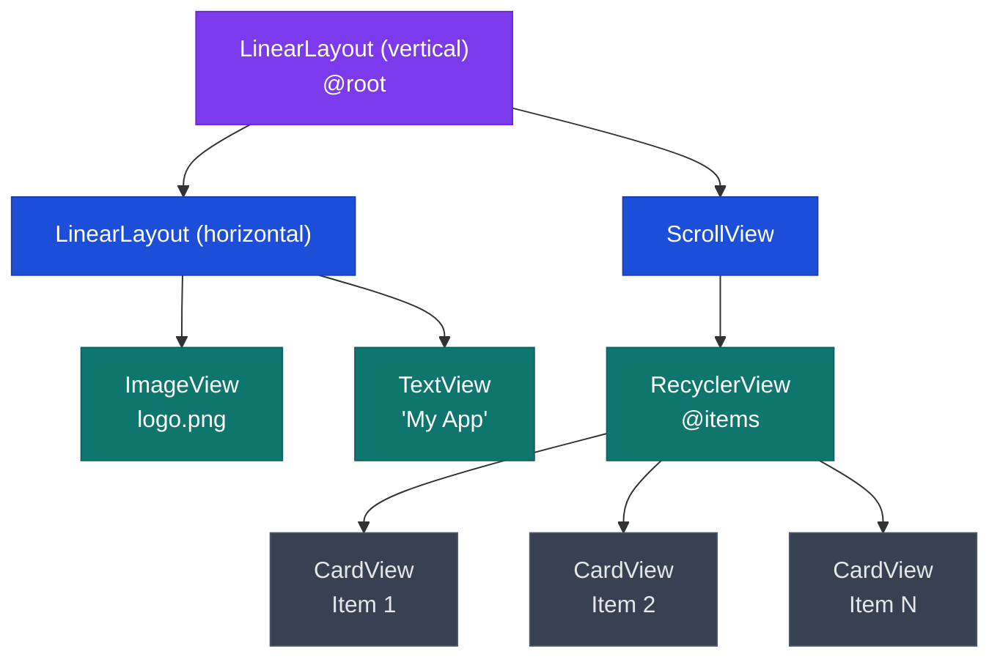
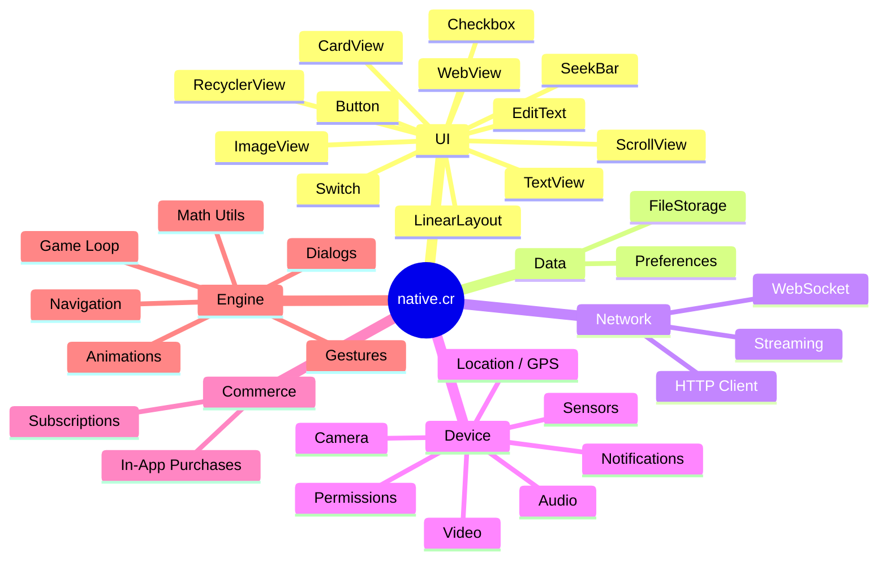

<picture>
  <source media="(prefers-color-scheme: dark)" srcset="https://raw.githubusercontent.com/slick-lab/native.cr/refs/heads/main/assets/logo.svg">
  
</picture>

# native.cr

[](https://crystal-lang.org/)
[](https://github.com/slick-lab/native.cr/releases)
[](https://developer.android.com/)
[](https://developer.apple.com/)
[](LICENSE)
[](https://github.com/slick-lab/native.cr/actions/workflows/ci.yml)
[](CONTRIBUTING.md)
[](https://discord.gg/nativecr)
[](https://shards.info/)
[](https://github.com/slick-lab/native.cr/stargazers)
[](https://github.com/slick-lab/native.cr)

**Write real native Android and iOS apps in Crystal — one codebase, compiled to true native code, no JavaScript runtime.**

> Think of native.cr as React Native, but for Crystal developers. Your app is a compiled binary — fast, small, and dependency-free at runtime.

---

## Why native.cr?

| | native.cr | React Native | Flutter |
|---|---|---|---|
| **Language** | Crystal | JavaScript / TypeScript | Dart |
| **Runtime** | None (compiled) | JavaScriptCore / Hermes | Dart VM / AOT |
| **UI layer** | Real native views via JNI / UIKit FFI | Native bridged | Custom renderer (Skia / Impeller) |
| **Hot reload** | ✓ with state | ✓ | ✓ |
| **Type safety** | Compile-time | Optional (TS) | Compile-time |
| **Memory model** | Minimal GC pauses | GC | GC |
| **Binary size** | Small | Large (JS bundle) | Medium |

Crystal gives you **Ruby-like syntax** with **C-like speed**. You write expressive, readable code and the compiler turns it into a native ARM64 binary. No interpreter, no JIT warmup, no garbage-collection pauses mid-animation.

On Android every widget is a real Android SDK `View` created and controlled through **JNI bindings** — not a custom renderer. On iOS the same widgets map to **UIKit views** via FFI. You get the platform's native look, feel, accessibility, and system integration for free.

---

## How it works



Crystal's compiler cross-compiles your code to ARM64.

**On Android**, the compiled binary is linked with `native_engine.o` into a single `libnative_app.so` shared library, along with `libnative_cr_android.jar` (precompiled Java helper classes). Every widget your Crystal code creates — `TextView`, `Button`, `LinearLayout` — is a real Android SDK `View` object instantiated through **JNI bindings**. The framework calls into the Android SDK directly; no custom renderer is involved. The result links into a standard APK.

**On iOS**, the binary exposes a set of C-callable entry points (`crystal_init`, `crystal_start`, `crystal_touch_began`, etc.) that are called by a thin Swift/Objective-C host. Every widget maps to a real **UIKit view** via FFI (`LibIOS.*` calls). The host wraps it all into a standard `.xcodeproj` that you open in Xcode and submit to the App Store.

**On desktop** (dev build only), the app runs on SDL + OpenGL for quick iteration without a physical device or emulator.

The result in all cases is a real, store-submittable app that uses the platform's own native view system — not a WebView and not a custom renderer.

---

## Hot reload — how it actually works

This is native.cr's killer development feature. You edit a file, save, and the running app updates in **under 2 seconds** — without losing your current state (scroll position, form data, counters, etc.).



### The `@[Preserve]` annotation

Mark any instance variable with `@[Preserve]` and it survives a reload automatically:

```crystal
class MyApp < Native::App
  @[Preserve]
  property score : Int32 = 0        # stays at 42 after a reload

  @[Preserve]
  property items : Array(String) = [] of String   # stays populated

  @tab_index : Int32 = 0            # NOT preserved — resets to 0
end
```

Under the hood, `@[Preserve]` fields are serialised to JSON before the old process exits and deserialised before `setup` runs in the new process. Any JSON-serialisable type works: `Int32`, `Float64`, `String`, `Bool`, `Array(T)`, `Hash(String, T)`.

### Start hot reload in development

```bash
native.cr reload main.cr
# Watching main.cr — save to reload…
# [12:04:01] Detected change, recompiling…
# [12:04:02] Reloaded in 1.3s — state restored
```

---

## App lifecycle


Your app class implements lifecycle hooks:

```crystal
class MyApp < Native::App
  def setup    : Nil  # required — build the UI, set @root
  def on_pause : Nil  # optional — app going to background
  def on_resume: Nil  # optional — app coming back to foreground
  def on_destroy: Nil # optional — process shutting down
  def on_touch_began(x : Float32, y : Float32)  : Nil  # optional
  def on_touch_moved(x : Float32, y : Float32)  : Nil  # optional
  def on_touch_ended(x : Float32, y : Float32)  : Nil  # optional
end
```

---

## Quick look

A complete counter app — persistent storage, hot-reload-safe state:

```crystal
require "native"

class CounterApp < Native::App
  @[Preserve]
  property count : Int32 = 0

  @prefs = Native::Storage::Preferences.new("app")

  def setup
    set_background_color(240, 240, 245)

    # Restore count from previous session
    @count = @prefs.get_int("count", default: 0)

    @label = Native::UI::TextView.new("Taps: #{@count}")
    @label.text_size = 28
    @label.center_horizontal

    btn = Native::UI::Button.new("Tap Me")
    btn.width            = 180
    btn.height           = 52
    btn.background_color = Native::Math::Color.from_hex(0x007AFF)
    btn.text_color       = Native::Math::Color.white
    btn.on_click {
      @count += 1
      @prefs.set("count", @count)
      @label.text = "Taps: #{@count}"
    }

    layout = Native::UI::LinearLayout.new
    layout.orientation = Native::UI::LinearLayout::Orientation::Vertical
    layout.gravity     = Native::UI::LinearLayout::Gravity::Center
    layout.addView(@label)
    layout.addView(btn)
    @root = layout
  end

  def on_pause
    @prefs.set("count", @count)   # flush to disk when backgrounded
  end
end

Native::App.start(CounterApp)
```

**Key points:**
- `setup` is the only method you must implement
- Assign `@root` to show your UI
- `@[Preserve]` keeps `@count` alive during hot reload
- `Native::Storage::Preferences` keeps it alive across full restarts

---

## UI widget tree

native.cr uses a tree of widgets composed in `setup`. The tree is rendered by the platform's native graphics pipeline.



---

## Platform support

| Platform | Min version | CPU target | UI layer | Status |
|---|---|---|---|---|
| Android | 7.0+ (API 24) | ARM64 | Real Android Views via JNI | ✅ Stable |
| iOS | 11+ | ARM64 | Real UIKit views via FFI | ✅ Stable |
| Desktop (dev) | — | x86\_64 / ARM64 | SDL + OpenGL (dev only) | ✅ Dev only |
| Windows | — | — | — | 🗺 Roadmap |
| Linux | — | — | — | 🗺 Roadmap |
| WebAssembly | — | — | — | 🗺 Roadmap |

Platform-specific branches use Crystal's compile-time flags:

```crystal

  # Android-only code

  # iOS-only code

  # Desktop dev build

```

---

## What's included



| Module | What you get |
|---|---|
| **UI** | `TextView`, `Button`, `ImageView`, `LinearLayout`, `ScrollView`, `RecyclerView`, `EditText`, `CardView`, `Checkbox`, `Switch`, `SeekBar`, `RadioButton`, `Spinner`, `WebView` |
| **Networking** | `HTTPClient` with base URL, `WebSocket`, streaming, request builder |
| **Storage** | `Preferences` (key-value) and `FileStorage` (Documents, Cache, Temporary) |
| **Permissions** | Unified permission API for camera, mic, location, notifications, storage, contacts |
| **Notifications** | Local push, scheduling, daily repeating reminders, channels, badge numbers |
| **Location** | GPS + network location, accuracy control, distance calculation (Haversine) |
| **Sensors** | Accelerometer, gyroscope, magnetometer, light, proximity, pressure, temperature, humidity |
| **Camera** | Live preview, front/back, flash modes, photo capture (`Bytes`), video recording |
| **Audio** | `Sound` (SFX), `MusicPlayer` (streaming), `AudioRecorder`, `AudioMixer` |
| **Video** | `VideoPlayer` (a `View` subclass), seek, loop, volume, scale types |
| **Payments** | In-app purchases and subscriptions (Google Play Billing + StoreKit), restore |
| **Animations** | Tweens, easing curves, animation sequences |
| **Gestures** | Tap, long press, pan, pinch, rotation, swipe |
| **Navigation** | Screen stack with transitions |
| **Dialogs** | Alert, confirmation, toast, loading, action sheet |
| **Game loop** | Fixed, variable, and adaptive update modes |
| **Math** | `Vector2`, `Vector3`, `Rect`, `Matrix3`, `Color` |

---

## Installation

### Prerequisites

| Tool | Why | Install |
|---|---|---|
| Crystal 1.20+ | The language | [crystal-lang.org/install](https://crystal-lang.org/install/) |
| Android NDK r25+ | Android cross-compilation | [developer.android.com/ndk](https://developer.android.com/ndk) |
| Xcode 14+ | iOS builds (macOS only) | Mac App Store |

### Step 1 — install the CLI

```bash
git clone https://github.com/slick-lab/native.cr
cd native.cr
make install
```

### Step 2 — verify your toolchain

```bash
native.cr --version
# Native 0.1.3

native.cr doctor
# ✓ Crystal 1.20.1
# ✓ Android NDK r25c
# ✓ Xcode 14.3
```

### Step 3 — add to a Crystal project

```yaml
# shard.yml
dependencies:
  native:
    github: slick-lab/native.cr
```

```bash
shards install
```

---

## Getting started in 4 commands

```bash
native.cr create MyApp   # scaffold a new project
cd MyApp
native.cr doctor         # verify prerequisites
native.cr reload main.cr # start hot-reload development
```

Then, when you're ready to ship:

```bash
native.cr build --android   # → build/MyApp.apk
native.cr build --ios       # → build/MyApp.xcodeproj (open in Xcode)
```

See the full **[Getting Started guide →](docs/getting-started.md)**

---

## Project layout

```
MyApp/
├── main.cr          ← entry point — your Native::App subclass
├── shard.yml        ← dependencies (native.cr + any other shards)
├── assets/
│   ├── images/      ← .png, .jpg, .svg
│   ├── sounds/      ← .wav, .mp3
│   └── fonts/       ← .ttf, .otf
└── src/             ← optional: split code across files
    ├── screens/
    └── components/
```

The native.cr library itself:

```
src/native/
├── app.cr               ← Native::App base class
├── framework/
│   ├── ui/              ← all widget classes
│   ├── media/           ← camera, audio, video
│   ├── network.cr
│   ├── storage.cr
│   ├── permissions.cr
│   ├── notifications.cr
│   ├── location.cr
│   ├── sensors.cr
│   ├── payment.cr
│   └── …
├── engine/
│   ├── android/         ← OpenGL ES + JNI bridge
│   └── ios/             ← Metal + Objective-C bridge
└── cli/                 ← create, build, reload, doctor
```

---

## Documentation

Every module has a beginner-friendly guide in [`docs/`](docs/):

| Guide | What it covers |
|---|---|
| [Getting Started](docs/getting-started.md) | Install, create, run your first app |
| [App Lifecycle](docs/app-lifecycle.md) | `Native::App`, `setup`, callbacks, `@[Preserve]` |
| [UI Components](docs/ui-components.md) | Every widget with full examples |
| [Networking](docs/networking.md) | HTTP requests, WebSockets, streaming |
| [Storage](docs/storage.md) | `Preferences` and `FileStorage` |
| [Permissions](docs/permissions.md) | Camera, location, microphone, and more |
| [Notifications](docs/notifications.md) | Local push, scheduling, daily reminders |
| [Location](docs/location.md) | GPS, accuracy modes, distance maths |
| [Sensors](docs/sensors.md) | Accelerometer, gyroscope, and all others |
| [Camera](docs/camera.md) | Preview, photo capture, video recording |
| [Audio](docs/audio.md) | Sound effects, music, microphone recording |
| [Video](docs/video.md) | Embedded video playback |
| [Payments](docs/payments.md) | In-app purchases and subscriptions |

---

## Examples

The [`examples/`](examples/) folder has runnable apps you can clone and run immediately:

| Example | What it shows |
|---|---|
| `examples/basic_app/` | Counter, form inputs, persistent storage |
| `examples/camera_app/` | Camera preview, photo capture, image display |

---

## Changelog

### v0.1.3 — current

- In-app purchases via Google Play Billing + StoreKit
- `VideoPlayer` widget (subclass of `View`)
- Gesture recognisers (tap, long press, pan, pinch, swipe)
- Navigation stack with transitions
- `AudioMixer` for global volume control

### v0.1.0 — 2026-06-02

- Android engine (OpenGL ES 2.0) + iOS engine (Metal)
- Full UI widget set
- HTTP client, WebSocket, streaming
- Storage, Sensors, Location, Camera, Audio, Notifications, Permissions
- Hot reload with `@[Preserve]` state preservation
- CLI: `create`, `build`, `reload`, `doctor`

Full history → [Changelog.md](Changelog.md)

---

## Roadmap

- [ ] WebSocket reconnection + backoff
- [ ] Maps integration (Google Maps / Apple Maps)
- [ ] QR code scanning
- [ ] Particle system
- [ ] Shader support (custom GLSL / Metal)
- [ ] Charts and graphs
- [ ] Remote push notifications (APNs / FCM)
- [ ] OTA updates over the air
- [ ] Hot reload on physical devices (currently emulator/simulator)
- [ ] Windows desktop support
- [ ] Linux desktop support
- [ ] WebAssembly target

---

## Requirements

| Requirement | Minimum version |
|---|---|
| Crystal | 1.20+ |
| Android NDK | r25+ |
| Xcode | 14+ |
| Android min SDK | API 24 (Android 7.0) |
| iOS minimum | iOS 11 |

---

## Contributing

Contributions are welcome. Please read [CONTRIBUTING.md](CONTRIBUTING.md) before opening a PR.

```bash
git clone https://github.com/slick-lab/native.cr
cd native.cr
make build    # compile the CLI
make test     # run the test suite
make format   # run crystal format
```

Commit message format: `type(scope): description`
Types: `feat`, `fix`, `docs`, `refactor`, `perf`, `test`, `chore`

---

## Community

| | |
|---|---|
| 💬 Discord | https://discord.gg/nativecr |
| 🐛 Issues | https://github.com/slick-lab/native.cr/issues |
| 🌐 Homepage | https://slick-lab.github.io/native.cr |
| 📧 Email | dev@native.cr |

---

## License

MIT — see [LICENSE](LICENSE) for details.
